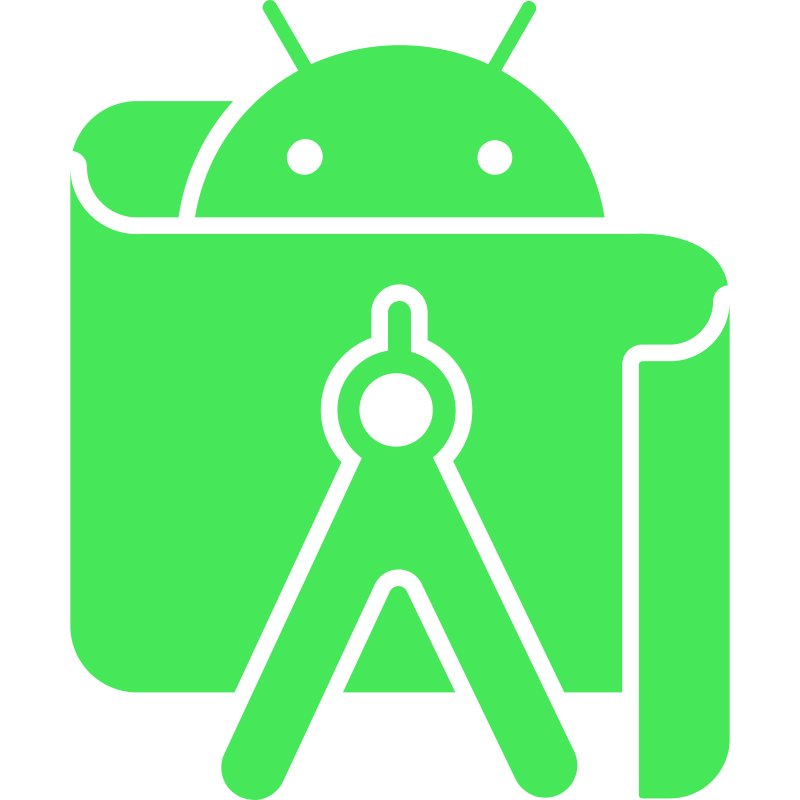

### Welcome! 👋

Soy Gabriel García y estudio FPGS Desarrollo de Aplicaciones Multiplataforma.

Empecé a programar hace dos años cuado comencé a estudiar el grado anteriormente mencionado, cuando descubrí que programar me gustaba y decidí dedicarme a ello.
Me gusta aprender cosas nuevas, utilidades, programas, herramientas, etc. No me cierro a nada y estoy dispuesto a seguir creciendo como desarrollador

Actualmente busco una empresa donde poder hacer prácticas y seguir mejorando

## Lenguajes

   

      
      
      
      
      
      
      
      
   
  
   
## Herramientas

   

      
      
      
      
   
